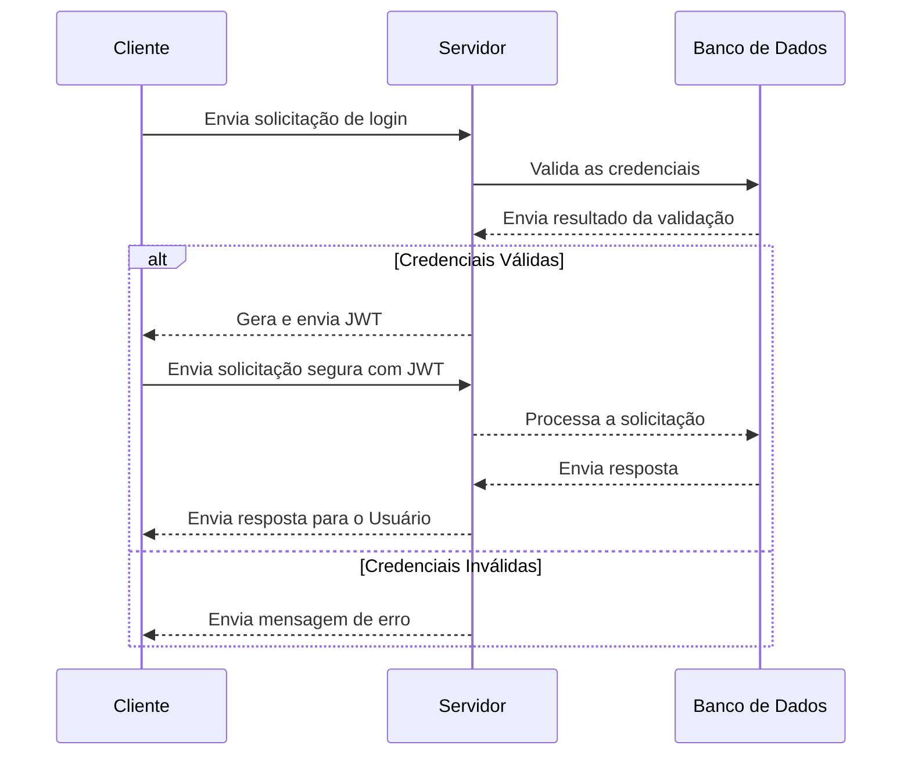

# Planejamento de Endpoints para o Backend do App Aluno Online (SAG)

## Sumário

- [Autenticação](#autenticanção)
- [Endpoints](#endpoints)
  - [Listar Disciplinas em Curso](#listar-disciplinas-em-curso)
  - [Listar Notas das Disciplinas em Curso](#listar-notas-das-disciplinas-em-curso)
  - [Listar Disciplinas Realizadas](#listar-disciplinas-realizadas)
  - [Listar RID Provisório](#listar-rid-provisório)
  - [Listar Disciplinas do Curriculo](#listar-disciplinas-do-curriculo)
  - [Listar Departamentos](#listar-departamentos)
  - [Listar Disciplinas por Departamento](#listar-disciplinas-por-departamento)
  - [Listar Detalhes de uma Disciplina](#listar-detalhes-de-uma-disciplina)

## Autenticanção

> A definir, abaixo segue um exemplo de como poderia ser feita a autenticação.

<!-- jwt -->



## Endpoints

> Os tipos abaixo estão descritos da forma em que são usados no código atualmente, por conta disso haverão redundâncias. Idealmente estes endpoints devem ser repensados/enxugados, mas isso acarretaria em uma refatoração do aplicativo.

### Listar Disciplinas em Curso

Lista todas as disciplinas em curso pelo aluno.

#### Requisição - Listar Disciplinas em Curso

```http
GET {BASE_URL}/api/v1/disciplinas-em-curso

Accept: application/json
```

#### Tipagem - Listar Disciplinas em Curso

```typescript
type AttendedSubjectClassInfo = {
  id: string;
  department: string;
  name: string;
  class: string;
  avaLocation: string;
  uerjLocation: string;
  teachers: string[];
  status: 'ACTIVE' | 'CANCELED';
};

type AttendedClassSchedule = {
  class: AttendedSubjectClassInfo;
  dayAlias: string;
  dayNumber: number;
  subject_id: string;
  start_time_in_minutes: number;
  end_time_in_minutes: number;
};

type EndpointResponse = {
  data: AttendedClassSchedule[];
};
```

#### Descrição - Listar Disciplinas em Curso

- **AttendedSubjectInfo**

Contém informações detalhadas sobre a disciplina/turma em curso.

| Campo          | Descrição                          |
| -------------- | ---------------------------------- |
| `id`           | Identificador/código da disciplina |
| `department`   | Departamento da disciplina         |
| `name`         | Nome da disciplina                 |
| `class`        | Turma da disciplina                |
| `avaLocation`  | URL para a turma AVA da disciplina |
| `uerjLocation` | Número/nome da sala da disciplina  |
| `status`       | Status da disciplina               |

- **AttendedClassesSchedule**

Contém informações sobre o horário de uma disciplina em curso.

| Campo                   | Descrição                                                               |
| ----------------------- | ----------------------------------------------------------------------- |
| `class`                 | JSON AttendedSubjectInfo, contendo informações sobre a disciplina       |
| `dayAlias`              | Nome do dia da semana                                                   |
| `dayNumber`             | Número do dia da semana, contado a partir de 0 (domingo)                |
| `subject_id`            | Identificador/código da disciplina                                      |
| `start_time_in_minutes` | Horário de início da disciplina em minutos, contados a partir de 00:00  |
| `end_time_in_minutes`   | Horário de término da disciplina em minutos, contados a partir de 00:00 |

- **EndpointResponse**

Contém a lista de JSON AttendedClassesSchedule, contendo informações sobre as disciplinas em curso. Cada item da lista representa um período de aula de uma disciplina, estes períodos podem ser em dias diferentes ou até mesmo em horários diferentes no mesmo dia.

| Campo  | Descrição                                                                                 |
| ------ | ----------------------------------------------------------------------------------------- |
| `data` | Lista de JSON AttendedClassesSchedule, contendo informações sobre as disciplinas em curso |

#### Exemplo de sucesso (JSON) - Listar Disciplinas em Curso

No exemplo abaixo existem duas disciplinas sendo cursadas pelo aluno:

- Cálculo Diferencial e Integral I
  - Segunda: 07:00 - 07:50 (M1)
  - Quarta: 07:00 - 07:50 (M1)
- Introdução ao Processamento de Dados
  - Terça: 08:00 - 09:40 (M2 - M3)

```http
Status: 200 OK
```

```json
{
  "data": [
    {
      "class": {
        "id": "508",
        "department": "IME",
        "name": "Cálculo Diferencial e Integral I",
        "class": "1",
        "avaLocation": "https://ava.uerj.br/course/view.php?id=508",
        "uerjLocation": "https://www.uerj.br/",
        "status": "APROVED"
      },
      "dayAlias": "Segunda",
      "dayNumber": 1,
      "subject_id": "508",
      "start_time_in_minutes": 420, // 07:00
      "end_time_in_minutes": 470 // 07:50
    },
    {
      "class": {
        "id": "627",
        "department": "IME",
        "name": "Introdução ao Processamento de Dados",
        "class": "1",
        "avaLocation": "https://ava.uerj.br/course/view.php?id=627",
        "uerjLocation": "https://www.uerj.br/",
        "status": "APROVED"
      },
      "dayAlias": "Terça",
      "dayNumber": 2,
      "subject_id": "1",
      "start_time_in_minutes": 480, // 08:00
      "end_time_in_minutes": 580 // 09:40
    },
    {
      "class": {
        "id": "508",
        "department": "IME",
        "name": "Cálculo Diferencial e Integral I",
        "class": "1",
        "avaLocation": "https://ava.uerj.br/course/view.php?id=508",
        "uerjLocation": "https://www.uerj.br/",
        "status": "APROVED"
      },
      "dayAlias": "Quarta",
      "dayNumber": 3,
      "subject_id": "508",
      "start_time_in_minutes": 420, // 07:00
      "end_time_in_minutes": 470 // 07:50
    }
  ]
}
```

#### Observações de casos atípicos - Listar Disciplinas em Curso

Em alguns momentos, uma mesma discipina pode possuir um horário na parte da manhã e outro na parte da tarde. Nesses casos, o endpoint retorna duas entradas para a mesma disciplina, uma para cada horário.

### Listar Notas das Disciplinas em Curso

Lista todas as notas disponíveis das disciplinas em curso pelo aluno.

#### Requisição - Notas das Disciplinas em Curso

```http
GET {BASE_URL}/api/v1/notas

Accept: application/json
```

#### Tipagem - Notas das Disciplinas em Curso

```typescript
type Grade = {
  p1?: number;
  p2?: number;
  pf?: number;
  result?: number;
};

type ClassGrade = {
  id: string;
  name: string;
  class: string;
  grades: Grade;
};

type EndpointResponse = {
  data: ClassGrade[];
};
```

#### Descrição - Notas das Disciplinas em Curso

- **Grade**

| Campo    | Descrição  |
| -------- | ---------- |
| `p1`     | Nota da P1 |
| `p2`     | Nota da P2 |
| `pf`     | Nota da PF |
| `result` | Nota final |

- **ClassGrade**

| Campo        | Descrição                                   |
| ------------ | ------------------------------------------- |
| `id`         | Identificador/código da disciplina          |
| `department` | Departamento da disciplina                  |
| `name`       | Nome da disciplina                          |
| `class`      | Turma da disciplina                         |
| `grades`     | JSON Grade, contendo as notas da disciplina |

#### Exemplo de sucesso (JSON) - Notas das Disciplinas em Curso

No exemplo abaixo existem duas disciplinas sendo cursadas pelo aluno:

- Cálculo Diferencial e Integral I
  - Nesse caso o professor lançou todas as notas: P1, P2 e PF.
  - P1: 8.0
  - P2: 7.0
  - PF: 6.0
  - Resultado: 7.0
- Introdução ao Processamento de Dados
  - Nesse caso o professor não lançou as notas da P1 e P2, somente a nota final.
  - Resultado: 7.0

```http
Status: 200 OK
```

```json
{
  "data": [
    {
      "id": "508",
      "department": "IME",
      "name": "Cálculo Diferencial e Integral I",
      "class": "1",
      "grades": {
        "p1": 8.0,
        "p2": 7.0,
        "pf": 6.0,
        "result": 7.0
      }
    },
    {
      "id": "627",
      "department": "IME",
      "name": "Introdução ao Processamento de Dados",
      "class": "1",
      "grades": {
        "p1": null,
        "p2": null,
        "pf": null,
        "result": 7.0
      }
    }
  ]
}
```

### Listar Disciplinas Realizadas

Lista todas as disciplinas que já foram cursadas pelo aluno, com suas respectivas notas, status e turmas.

#### Requisição - Listar Disciplinas Realizadas

```http
GET {BASE_URL}/api/v1/disciplinas-realizadas

Accept: application/json
```

#### Tipagem - Listar Disciplinas Realizadas

```typescript
type SubjectTaken = {
  id: string;
  department: string;
  name: string;
  period: string;
  credits?: number;
  workload?: number;
  type: 'MANDATORY' | 'RESTRICTED_ELECTIVE' | 'DEFINED_ELECTIVE' | 'UNIVERSAL';
  frequency?: number;
  grade?: number;
  status:
    | 'APPROVED'
    | 'FAILED_BY_GRADE'
    | 'FAILED_BY_ATTENDANCE'
    | 'CANCELED'
    | 'EXEMPT';
};

type EndpointResponse = {
  data: SubjectTaken[];
};
```

#### Descrição - Listar Disciplinas Realizadas

- **SubjectTaken**

| Campo        | Descrição                                                     |
| ------------ | ------------------------------------------------------------- |
| `id`         | Identificador/código da disciplina                            |
| `department` | Departamento da disciplina                                    |
| `name`       | Nome da disciplina                                            |
| `period`     | Período em que a disciplina foi cursada (Ex.: 2022.1)         |
| `credits`    | Créditos da disciplina, caso exista                           |
| `workload`   | Carga horária da disciplina, caso exista                      |
| `type`       | Tipo da disciplina (Ex.: Obrigatória, Eletiva, etc)           |
| `frequency`  | Frequência do aluno na disciplina em porcentagem, caso exista |
| `grade`      | Nota final do aluno na disciplina, caso exista                |
| `status`     | Status da disciplina                                          |

Descrição do campo `type`:

| Valor                 | Descrição        |
| --------------------- | ---------------- |
| `MANDATORY`           | Obrigatória      |
| `RESTRICTED_ELECTIVE` | Eletiva Restrita |
| `DEFINED_ELECTIVE`    | Eletiva Definida |
| `UNIVERSAL`           | Universal        |

Descrição do campo `status`:

| Valor                  | Descrição                |
| ---------------------- | ------------------------ |
| `APPROVED`             | Aprovado                 |
| `FAILED_BY_GRADE`      | Reprovado por nota       |
| `FAILED_BY_ATTENDANCE` | Reprovado por frequência |
| `CANCELED`             | Cancelado                |
| `EXEMPT`               | Isento                   |

#### Exemplo de sucesso (JSON) - Listar Disciplinas Realizadas

No exemplo abaixo existem duas disciplinas que já foram cursadas pelo aluno:

- Cálculo Diferencial e Integral I

  - Período: 2022.1
  - Créditos: 6
  - Carga Horária: 90
  - Tipo: Obrigatória
  - Frequência: 100%
  - Nota: 7.0
  - Status: Aprovado

- Introdução ao Processamento de Dados
  - Período: 2022.1
  - Créditos: 4
  - Carga Horária: 60
  - Tipo: Obrigatória
  - Frequência: 83%
  - Nota: 7.0
  - Status: Aprovado

```http
Status: 200 OK
```

```json
{
  "data": [
    {
      "id": "508",
      "department": "IME",
      "name": "Cálculo Diferencial e Integral I",
      "period": "2022.1",
      "credits": 6,
      "workload": 90,
      "type": "MANDATORY",
      "frequency": 100,
      "grade": 7.0,
      "status": "APPROVED"
    },
    {
      "id": "627",
      "department": "IME",
      "name": "Introdução ao Processamento de Dados",
      "period": "2022.1",
      "credits": 4,
      "workload": 60,
      "type": "MANDATORY",
      "frequency": 83,
      "grade": 7.0,
      "status": "APPROVED"
    }
  ]
}
```

#### Observações de casos atípicos - Listar Disciplinas Realizadas

O campo `grade` pode ser `null` caso o aluno seja reprovado por frequência ou caso a disciplina não possua nota.

### Listar RID Provisório

Lista o resultado do RID Provisório do aluno.

#### Requisição - Listar RID Provisório

```http
GET {BASE_URL}/api/v1/rid-provisório

Accept: application/json
```

#### Tipagem - Listar RID Provisório

```typescript
type SubjectClassTempRID = {
  id: string;
  department: string;
  name: string;
  class: string;
  available: number;
  requested: number;
  position: number;
  status: string;
};

type EndpointResponse = {
  data: SubjectClassTempRID[];
  lastUpdatedAt: string;
};
```

#### Descrição - Listar RID Provisório

- **SubjectClassTempRID**

| Campo        | Descrição                          |
| ------------ | ---------------------------------- |
| `id`         | Identificador/código da disciplina |
| `department` | Departamento da disciplina         |
| `name`       | Nome da disciplina                 |
| `class`      | Turma da disciplina                |
| `available`  | Número de vagas disponíveis        |
| `requested`  | Número de vagas solicitadas        |
| `position`   | Posição do aluno na fila de espera |
| `status`     | Status da solicitação              |

- **EndpointResponse**

| Campo           | Descrição                                                                   |
| --------------- | --------------------------------------------------------------------------- |
| `data`          | Lista de JSON SubjectClassTempRID, contendo informações sobre o RID Parcial |
| `lastUpdatedAt` | Data e hora da última atualização do RID Provisório, no formato ISO 8601    |

#### Exemplo de sucesso (JSON) - Listar RID Provisório

No exemplo abaixo existem duas disciplinas que o aluno se inscreveu, das quais aparecem no RID Provisório:

- Cálculo Diferencial e Integral I

  - Turma: 1
  - Vagas Disponíveis: 10
  - Vagas Solicitadas: 20
  - Posição na Fila: 5
  - Status: Aprovado

- Introdução ao Processamento de Dados
  - Turma: 1
  - Vagas Disponíveis: 10
  - Vagas Solicitadas: 20
  - Posição na Fila: 5
  - Status: Aprovado

```http
Status: 200 OK
```

```json
{
  "data": [
    {
      "id": "508",
      "department": "IME",
      "name": "Cálculo Diferencial e Integral I",
      "class": "1",
      "available": 10,
      "requested": 20,
      "position": 5,
      "status": "Dependendo de Vaga"
    },
    {
      "id": "627",
      "department": "IME",
      "name": "Introdução ao Processamento de Dados",
      "class": "1",
      "available": 10,
      "requested": 20,
      "position": 5,
      "status": "Dependendo de Vaga"
    }
  ],
  "lastUpdatedAt": "2021-09-01T00:00:00.000Z"
}
```

### Listar Disciplinas do Curriculo

Lista todas as disciplinas do currículo do aluno. Possui um parâmetro opcional para mostrar somente as disciplinas que o aluno ainda não cursou (a cursar).

#### Requisição - Listar Disciplinas do Curriculo

Requisição sem o parâmetro `not_taken_only`, listando todas as disciplinas do currículo:

```http
GET {BASE_URL}/api/v1/disciplinas-curriculo

Accept: application/json
```

Requisição com o parâmetro `not_taken_only`, listando somente as disciplinas que o aluno ainda precisa cursar:

```http
GET {BASE_URL}/api/v1/disciplinas-curriculo?not_taken_only=true

Accept: application/json
```

#### Tipagem - Listar Disciplinas do Curriculo

```typescript
type SubjectInfo = {
  id: string;
  department: string;
  name: string;
  type: 'MANDATORY' | 'RESTRICTED_ELECTIVE' | 'DEFINED_ELECTIVE' | 'UNIVERSAL';
  branch?: string;
  period?: number;
  allow_conflict: boolean;
  minimum_credits: number;
  has_prerequisites: boolean;
  group?: string;
  credits?: number;
  workload?: number;
};

type EndpointResponse = {
  data: SubjectInfo[];
};
```

#### Descrição - Listar Disciplinas do Curriculo

- **SubjectInfo**

| Campo               | Descrição                                                 |
| ------------------- | --------------------------------------------------------- |
| `id`                | Identificador/código da disciplina                        |
| `department`        | Departamento da disciplina                                |
| `name`              | Nome da disciplina                                        |
| `type`              | Tipo da disciplina (Ex.: Obrigatória, Eletiva, etc)       |
| `branch`            | Ramo da disciplina, caso exista                           |
| `period`            | Período recomendado para cursar a disciplina, caso exista |
| `allow_conflict`    | Permite conflito de horários                              |
| `minimum_credits`   | Créditos mínimos para cursar a disciplina                 |
| `has_prerequisites` | Possui pré-requisitos                                     |
| `group`             | Grupo da disciplina, caso exista                          |
| `credits`           | Créditos da disciplina, caso exista                       |
| `workload`          | Carga horária da disciplina, caso exista                  |

#### Exemplo de sucesso (JSON) - Listar Disciplinas do Curriculo

No exemplo abaixo existem duas disciplinas que o aluno ainda precisa cursar:

- Física II
  - Tipo: Obrigatória
  - Créditos Mínimos: 6
  - Período: 1
  - Permite Conflito de Horários: Sim
  - Possui Pré-requisitos: Não
  - Créditos: 6
  - Carga Horária: 90
- Geometria Descritiva I
  - Tipo: Obrigatória
  - Créditos Mínimos: 6
  - Período: 1
  - Permite Conflito de Horários: Sim
  - Possui Pré-requisitos: Não
  - Créditos: 6
  - Carga Horária: 90

```http
Status: 200 OK
```

```json
{
  "data": [
    {
      "id": "5143",
      "department": "FIS",
      "name": "Física II",
      "type": "MANDATORY",
      "branch": "79",
      "period": 2,
      "allow_conflict": true,
      "minimum_credits": 6,
      "has_prerequisites": false,
      "group": null,
      "credits": 6,
      "workload": 90
    },
    {
      "id": "1913",
      "department": "IME",
      "name": "Geometria Descritiva I",
      "type": "MANDATORY",
      "branch": "79",
      "period": 1,
      "allow_conflict": true,
      "minimum_credits": 6,
      "has_prerequisites": false,
      "group": null,
      "credits": 6,
      "workload": 90
    }
  ]
}
```

### Listar Departamentos

Lista todos os departamentos da UERJ.

#### Requisição - Listar Departamentos

```http
GET {BASE_URL}/api/v1/departamentos

Accept: application/json
```

#### Tipagem - Listar Departamentos

```typescript
type DepartmentInfo = {
  id: string;
  alias: string;
  name: string;
};

type EndpointResponse = {
  data: DepartmentInfo[];
};
```

#### Descrição - Listar Departamentos

- **DepartmentInfo**

| Campo   | Descrição                            |
| ------- | ------------------------------------ |
| `id`    | Identificador/código do departamento |
| `alias` | Sigla do departamento                |
| `name`  | Nome do departamento                 |

#### Exemplo de sucesso (JSON) - Listar Departamentos

No exemplo abaixo existem dois departamentos:

- Faculdade de Engenharia
- Instituto de Matemática e Estatística

```http
Status: 200 OK
```

```json
{
  "data": [
    {
      "id": "1",
      "alias": "FEN",
      "name": "Faculdade de Engenharia"
    },
    {
      "id": "2",
      "alias": "IME",
      "name": "Instituto de Matemática e Estatística"
    }
  ]
}
```

### Listar Disciplinas por Departamento

Lista todas as disciplinas de um determinado departamento. Possui dois parâmetros:

- `department_id`: ID do departamento da disciplina _(obrigatório)_
- `universal_only`: Mostra somente as disciplinas universais _(opcional)_

#### Requisição - Listar Disciplinas por Departamento

Requisição sem o parâmetro `universal_only`, listando todas as disciplinas do departamento:

```http
GET {BASE_URL}/api/v1/departamentos/{department_id}/disciplinas

Accept: application/json
```

Requisição com o parâmetro `universal_only`, listando somente as disciplinas universais do departamento:

```http
GET {BASE_URL}/api/v1/departamentos/{department_id}/disciplinas?universal_only=true

Accept: application/json
```

#### Tipagem - Listar Disciplinas por Departamento

```typescript
type SubjectInfo = {
  id: string;
  department: string;
  name: string;
  type: 'MANDATORY' | 'RESTRICTED_ELECTIVE' | 'DEFINED_ELECTIVE' | 'UNIVERSAL';
  branch?: string;
  period?: number;
  allow_conflict: boolean;
  minimum_credits: number;
  has_prerequisites: boolean;
  group?: string;
  credits?: number;
  workload?: number;
};

type EndpointResponse = {
  data: SubjectInfo[];
};
```

#### Descrição - Listar Disciplinas por Departamento

- **SubjectInfo**

Visualizar descrição em [Tipagem - Listar Disciplinas do Curriculo](#tipagem---listar-disciplinas-do-curriculo)

#### Exemplo de sucesso (JSON) - Listar Disciplinas por Departamento

No exemplo abaixo são listadas todas as disciplinas do departamento de Física:

- Física I

  - Tipo: Obrigatória
  - Créditos Mínimos: 6
  - Período: 1
  - Permite Conflito de Horários: Sim
  - Possui Pré-requisitos: Não
  - Créditos: 6
  - Carga Horária: 90

- Física II
  - Tipo: Obrigatória
  - Créditos Mínimos: 6
  - Período: 2
  - Permite Conflito de Horários: Sim
  - Possui Pré-requisitos: Não
  - Créditos: 6
  - Carga Horária: 90

```http
Status: 200 OK
```

```json
{
  "data": [
    {
      "id": "5142",
      "department": "FIS",
      "name": "Física I",
      "type": "MANDATORY",
      "branch": "79",
      "period": 1,
      "allow_conflict": true,
      "minimum_credits": 6,
      "has_prerequisites": false,
      "group": null,
      "credits": 6,
      "workload": 90
    },
    {
      "id": "5143",
      "department": "FIS",
      "name": "Física II",
      "type": "MANDATORY",
      "branch": "79",
      "period": 2,
      "allow_conflict": true,
      "minimum_credits": 6,
      "has_prerequisites": false,
      "group": null,
      "credits": 6,
      "workload": 90
    }
  ]
}
```

### Listar Detalhes de uma Disciplina

Lista os detalhes de uma disciplina, incluindo suas informações e informações sobre as turmas.

#### Requisição - Listar Detalhes de uma Disciplina

```http
GET {BASE_URL}/api/v1/disciplinas/{subject_id}

Accept: application/json
```

#### Tipagem - Listar Detalhes de uma Disciplina

```typescript
type SubjectPrerequisite = {
  id: string;
  name: string;
};

type SubjectInfo = {
  id: string;
  department: string;
  name: string;
  type: 'MANDATORY' | 'RESTRICTED_ELECTIVE' | 'DEFINED_ELECTIVE' | 'UNIVERSAL';
  branch?: string;
  period?: number;
  allow_conflict: boolean;
  minimum_credits: number;
  has_prerequisites: boolean;
  group?: string;
  credits?: number;
  workload?: number;
  prerequisites?: SubjectPrerequisite[];
};

type SubjectClassSchedule = {
  dayAlias: string;
  dayNumber: number;
  start_time_in_minutes: number;
  end_time_in_minutes: number;
};

type SubjectClassInfo = {
  id: string;
  department: string;
  name: string;
  class: string;
  teachers: string[];
  schedule: SubjectClassSchedule[];
  vacancies: number;
  available: number;
  requested: number;
};

type EndpointResponse = {
  data: {
    subject: SubjectInfo;
    classes: SubjectClassInfo[];
  };
};
```

#### Descrição - Listar Detalhes de uma Disciplina

- **SubjectPrerequisite**

| Campo  | Descrição                          |
| ------ | ---------------------------------- |
| `id`   | Identificador/código da disciplina |
| `name` | Nome da disciplina                 |

- **SubjectInfo**

Visualizar descrição em [Tipagem - Listar Disciplinas do Curriculo](#tipagem---listar-disciplinas-do-curriculo)

No campo `prerequisites` é listado uma matriz de JSON _SubjectPrerequisite_, contendo informações sobre os pré-requisitos da disciplina. Cada linha representa um conjunto de pré-requisitos, onde o aluno precisa cursar **pelo menos uma** das disciplinas listadas na linha.

- **SubjectClassSchedule**

Visualizar descrição em [Tipagem - Listar Disciplinas em Curso](#tipagem---listar-disciplinas-em-curso)

- **SubjectClassInfo**

| Campo        | Descrição                                                                              |
| ------------ | -------------------------------------------------------------------------------------- |
| `id`         | Identificador/código da disciplina                                                     |
| `department` | Departamento da disciplina                                                             |
| `name`       | Nome da disciplina                                                                     |
| `class`      | Turma da disciplina                                                                    |
| `teachers`   | Lista do nome dos professores da turma                                                 |
| `schedule`   | Lista de JSON SubjectClassSchedule, contendo informações sobre o horário da disciplina |
| `vacancies`  | Número de vagas da turma                                                               |
| `available`  | Número de vagas disponíveis da turma                                                   |
| `requested`  | Número de vagas solicitadas da turma                                                   |

- **EndpointResponse**

| Campo     | Descrição                                                                          |
| --------- | ---------------------------------------------------------------------------------- |
| `subject` | JSON SubjectInfo, contendo informações sobre a disciplina                          |
| `classes` | Lista de JSON SubjectClassInfo, contendo informações sobre as turmas da disciplina |

#### Exemplo de sucesso (JSON) - Listar Detalhes de uma Disciplina

No exemplo abaixo são listados os detalhes da disciplina de Cálculo Diferencial e Integral I:

- Cálculo Diferencial e Integral II
  - Tipo: Obrigatória
  - Créditos Mínimos: 6
  - Período: 1
  - Permite Conflito de Horários: Sim
  - Possui Pré-requisitos: Não
  - Créditos: 6
  - Carga Horária: 90
  - Pré-requisitos: (Cálculo Diferencial e Integral I OU Cálculo I) e Álgebra Linear I
  - Turmas:
    - Turma 1
      - Professores: Carlos Alberto, João da Silva
      - Horários:
        - Segunda: 07:00 - 07:50 (M1)
        - Quarta: 07:00 - 07:50 (M1)
      - Vagas: 10
      - Vagas Disponíveis: 10
      - Vagas Solicitadas: 20
    - Turma 2
      - Professor: Thiago Rodrigues
      - Horários:
        - Segunda: 07:00 - 08:40 (M1~M2)
      - Vagas: 10
      - Vagas Disponíveis: 15
      - Vagas Solicitadas: 20

```http
Status: 200 OK
```

```json
{
  "data": {
    "subject": {
      "id": "CDI2",
      "department": "IME",
      "name": "Cálculo Diferencial e Integral II",
      "type": "MANDATORY",
      "branch": "396",
      "period": 1,
      "allow_conflict": true,
      "minimum_credits": 6,
      "has_prerequisites": false,
      "group": "A",
      "credits": 6,
      "workload": 90,
      "prerequisites": [["CDI1", "CALC1"], ["ALIN1"]]
    },
    "classes": [
      {
        "id": "CDI2",
        "department": "IME",
        "name": "Cálculo Diferencial e Integral II",
        "class": "1",
        "teachers": ["Carlos Alberto", "João da Silva"],
        "schedule": [
          {
            "dayAlias": "Segunda",
            "dayNumber": 1,
            "start_time_in_minutes": 420,
            "end_time_in_minutes": 470
          },
          {
            "dayAlias": "Quarta",
            "dayNumber": 3,
            "start_time_in_minutes": 420,
            "end_time_in_minutes": 470
          }
        ],
        "vacancies": 10,
        "available": 10,
        "requested": 20
      },
      {
        "id": "CDI2",
        "department": "IME",
        "name": "Cálculo Diferencial e Integral II",
        "class": "2",
        "teachers": ["Thiago Rodrigues"],
        "schedule": [
          {
            "dayAlias": "Segunda",
            "dayNumber": 1,
            "start_time_in_minutes": 420,
            "end_time_in_minutes": 530
          }
        ],
        "vacancies": 10,
        "available": 15,
        "requested": 20
      }
    ]
  }
}
```
